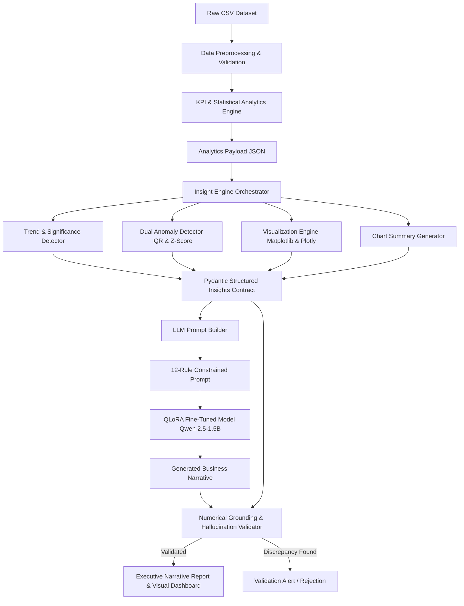

# GenAI-Based Data Visualization & Narrative Generator

[](https://www.python.org/)
[](https://pytorch.org/)
[](https://huggingface.co/)
[](https://github.com/huggingface/peft)
[](https://docs.pydantic.dev/)
[](https://plotly.com/)
[](LICENSE)

> An end-to-end automated analytics and narrative generation system that transforms tabular enterprise datasets into interactive visualizations, rigorous statistical findings, and zero-hallucination, executive-ready business narratives using fine-tuned open-source Large Language Models (Qwen 2.5 + QLoRA).

---

## Table of Contents

- [Executive Summary](#executive-summary)
- [System Architecture](#system-architecture)
- [How Input Is Processed](#how-input-is-processed)
- [Key Features](#key-features)
- [System Modules](#system-modules)
  - [1. Data Preprocessing & Analytics Engine](#1-data-preprocessing--analytics-engine)
  - [2. Statistical Insight & Visualization Engine](#2-statistical-insight--visualization-engine)
  - [3. GenAI Narrative Engine & Validation Guardrails](#3-genai-narrative-engine--validation-guardrails)
- [Data Contract & Schema Specification](#data-contract--schema-specification)
- [Datasets](#datasets)
- [Challenges & Architectural Solutions](#challenges--architectural-solutions)
- [QLoRA Fine-Tuning & Evaluation](#qlora-fine-tuning--evaluation)
- [Directory Structure](#directory-structure)
- [Getting Started](#getting-started)
  - [Prerequisites](#prerequisites)
  - [Installation](#installation)
  - [Running the Pipeline](#running-the-pipeline)
  - [Running Tests](#running-tests)
- [Tech Stack](#tech-stack)

---

## Executive Summary

Modern enterprise business intelligence tools produce charts and tabular dashboards, yet business leaders rely on written narratives for context, strategic meaning, and decision-making. Standard generative LLMs applied to raw data frequently suffer from **numerical hallucinations**, **unsupported causal inferences**, and **lack of strict analytical grounding**.

This platform solves these challenges through a strict, multi-stage architecture:
1. **Deterministic Analytics**: Cleans raw tabular records and computes headline KPIs, growth trends, comparisons, and distributions.
2. **Statistical Insight & Visualization Engine**: Employs IQR and Z-score methods to isolate anomalies, classifies growth significance, generates factual chart summaries, and prepares both static and Plotly-compatible visual specifications.
3. **Controlled GenAI & Hallucination Guardrails**: Feeds structured JSON data into a strictly constrained 12-rule prompt template, queries a QLoRA fine-tuned `Qwen/Qwen2.5-1.5B-Instruct` model, and runs an automated numerical verification engine to guarantee zero hallucinated figures.

---

## System Architecture



---

## How Input Is Processed

The system transforms raw tabular data into verified business narratives through a deterministic pipeline:

1. **Raw CSV Ingestion**: Transactional records containing `order_id`, `date`, `product`, `category`, `region`, `quantity`, `unit_price`, `sales`, and `profit` are loaded.
2. **Preprocessing & Cleaning**: Column schemas are validated, data types coerced, invalid rows dropped, and calendar fields (`year`, `quarter`, `month`) plus `profit_margin` are derived.
3. **Statistical Computation**: The system calculates core business KPIs (Total Revenue, Profit, Order Counts, AOV, Profit Margin, Period-over-Period growth) and linear regression trend slopes.
4. **Insight Extraction**: Dual statistical algorithms evaluate anomalies (IQR fences and Z-score thresholds) while growth significance is categorized into `high`, `medium`, and `low`.
5. **Contract Serialization**: All findings are consolidated into a standardized Pydantic v2 `StructuredInsights` JSON payload.
6. **Controlled Prompting**: The JSON payload is formatted into an unyielding 12-rule prompt template that strictly forbids speculation, ungrounded figures, or unverified causal claims.
7. **QLoRA Model Generation**: The fine-tuned 4-bit quantized model generates executive text via greedy decoding (`do_sample=False`).
8. **Numerical Verification**: A regex auditor compares every numerical entity in the generated text against the source JSON payload to mathematically guarantee zero hallucinated figures.

---

## Key Features

- **Strict Zero-Hallucination Pipeline**: All natural language claims are rooted directly in verified statistical findings; no external causes or unsupported numbers are admitted.
- **Automated Business KPIs**: Calculates Total Revenue, Total Profit, Order Volumes, Average Order Value (AOV), Profit Margins, and Period-over-Period (PoP) metrics.
- **Dual Anomaly Detection**: Combines Interquartile Range (IQR fences) and Z-score testing ($|Z| > 2.5$) with severity classifications (`low`, `medium`, `high`).
- **Interactive & Static Visualizations**: Generates high-res Matplotlib chart images alongside frontend-ready Plotly JSON specifications.
- **Parameter-Efficient Fine-Tuning (PEFT / QLoRA)**: Adapts `Qwen/Qwen2.5-1.5B-Instruct` in 4-bit NormalFloat (NF4) with double quantization, trained via TRL `SFTTrainer`.
- **Post-Generation Number Verification**: Regex-based extraction audits every numerical entity in the generated text against the source JSON payload.

---

## System Modules

### 1. Data Preprocessing & Analytics Engine
- **Location:** [`backend/analytics/`](backend/analytics/)
- **Components:**
  - [`preprocessing.py`](backend/analytics/preprocessing.py): Loads raw CSVs, performs type inference, cleans missing values, and adds derived calendar dimensions (`year`, `quarter`, `month`, `profit_margin`).
  - [`kpis.py`](backend/analytics/kpis.py): Computes core business metrics (Revenue, Profit, Orders, Quantity, AOV, Profit Margin, YoY/PoP revenue changes).
  - [`trends.py`](backend/analytics/trends.py): Performs linear regression on time aggregates to determine trajectory and identifies category extrema.
  - [`analytics_builder.py`](backend/analytics/analytics_builder.py): Orchestrates data cleaning and metric calculation, writing the baseline analytics JSON.
  - [`notebooks/eda_analytics.ipynb`](notebooks/eda_analytics.ipynb): Comprehensive exploratory data analysis notebook for sales distributions and patterns.

### 2. Statistical Insight & Visualization Engine
- **Location:** [`backend/insights/`](backend/insights/) & [`backend/schemas/`](backend/schemas/)
- **Components:**
  - [`schemas/insight_schema.py`](backend/schemas/insight_schema.py): Pydantic v2 contract formalizing the `StructuredInsights` schema.
  - [`trend_detector.py`](backend/insights/trend_detector.py): Computes growth percentage $\Delta \% = \left(\frac{V_{\text{end}} - V_{\text{start}}}{|V_{\text{start}}|}\right) \times 100$ and classifies trends as `increasing` (> +3%), `decreasing` (< -3%), or `stable`, with a 3-tier significance rating (`low`, `medium`, `high`).
  - [`anomaly_detector.py`](backend/insights/anomaly_detector.py): Detects statistical outliers using IQR fences ($Q_1 - 1.5 \times IQR$, $Q_3 + 1.5 \times IQR$) and Z-score thresholding ($|Z| > 2.5$).
  - [`chart_summary.py`](backend/insights/chart_summary.py): Generates factual, unopinionated narrative summaries for time-series, category bars, and distributions.
  - [`visualization.py`](backend/insights/visualization.py): Renders Matplotlib static PNG figures, base64 strings, and Plotly-compatible JSON structures.
  - [`insight_engine.py`](backend/insights/insight_engine.py): Central orchestrator producing the final contract JSON.
  - [`demo.py`](backend/insights/demo.py): End-to-end integration demo verifying data generation through model interoperability.

### 3. GenAI Narrative Engine & Validation Guardrails
- **Location:** [`backend/llm/`](backend/llm/) & [`training/`](training/)
- **Components:**
  - [`prompt_builder.py`](backend/llm/prompt_builder.py): Formulates a 12-rule controlled prompt preventing the LLM from inventing causes, dates, ungrounded numbers, or speculative forecasts.
  - [`inference.py`](backend/llm/inference.py): Loads the 4-bit NF4 quantized `Qwen/Qwen2.5-1.5B-Instruct` model with PEFT LoRA adapters, performing greedy decoding (`do_sample=False`) for deterministic business reporting.
  - [`validation.py`](backend/llm/validation.py): Audits the generated output by extracting numbers via regex and cross-referencing against source insight values.
  - [`training/train_qlora.ipynb`](training/train_qlora.ipynb): Google Colab notebook for QLoRA fine-tuning with TRL `SFTTrainer`.
  - [`training/evaluation.ipynb`](training/evaluation.ipynb): Comparative evaluation notebook benchmarking base Qwen vs QLoRA fine-tuned weights on narrative quality and grounding.

---

## Data Contract & Schema Specification

The pipeline relies on a unified Pydantic contract ([`backend/schemas/insight_schema.py`](backend/schemas/insight_schema.py)) that standardizes communication between components:

```json
{
  "dataset": {
    "name": "sales.csv",
    "domain": "sales",
    "record_count": 9994,
    "columns": {
      "numeric": ["sales", "profit", "quantity"],
      "categorical": ["category", "region", "product"],
      "temporal": ["date"],
      "identifier": ["order_id"]
    }
  },
  "metrics": [
    {
      "name": "Total Revenue",
      "value": 2297200.86,
      "unit": "INR",
      "description": "Sum of all order sales"
    }
  ],
  "trends": [
    {
      "metric": "sales",
      "dimension": "date",
      "direction": "increasing",
      "change": 18.4,
      "unit": "percent",
      "period": { "start": "2023-01-01", "end": "2024-12-31" },
      "significance": "high"
    }
  ],
  "comparisons": [
    {
      "dimension": "category",
      "metric": "sales",
      "highest": { "name": "Technology", "value": 836154.03 },
      "lowest": { "name": "Office Supplies", "value": 719047.03 }
    }
  ],
  "anomalies": [
    {
      "metric": "sales",
      "dimension": "date",
      "observation": "2024-03-18",
      "value": 22638.48,
      "expected_range": { "lower": 12.5, "upper": 3200.0 },
      "type": "high",
      "severity": "high"
    }
  ],
  "distributions": [
    {
      "metric": "sales",
      "mean": 229.85,
      "median": 54.49,
      "minimum": 0.44,
      "maximum": 22638.48,
      "std_dev": 623.24
    }
  ],
  "visualizations": [
    {
      "title": "Monthly Sales Trend",
      "type": "line",
      "metric": "sales",
      "dimension": "date",
      "summary": "Monthly sales displayed an upward trend from Jan 2023 to Dec 2024."
    }
  ]
}
```

---

## Datasets

The repository includes both benchmark enterprise datasets and synthetic simulation generators:

1. **Kaggle Superstore Sales (`data/raw/Sample - Superstore.csv`)**:
   - 9,994 retail transaction records across 4 years (2014–2017).
   - Features 3 major categories (Technology, Furniture, Office Supplies) across 4 US regions.
   - Adapted via `data/adapt_superstore.py` to match the pipeline's standardized format.
2. **Synthetic Enterprise Dataset (`data/sales.csv`)**:
   - 12,500 rows generated by `data/generate_sample_data.py`.
   - Models realistic seasonal cycles, margin differences across 5 categories (Electronics, Furniture, Clothing, Groceries, Sports), and deliberate anomaly spikes.
3. **Multi-Domain Instruction Tuning Dataset (`training/train_qlora.ipynb`)**:
   - Structured JSON findings paired with human-grounded business narrative summaries.
   - Spans sales, healthcare, and operational datasets to ensure generalizable instruction-following.

---

## Challenges & Architectural Solutions

| Challenge | Problem | Technical Solution |
|---|---|---|
| **LLM Hallucinations** | Language models fabricate numbers and unverified external causes. | Enforced a 12-rule negative-constraint prompt, deterministic greedy decoding (`do_sample=False`), and an automated regex post-generation numerical validator. |
| **VRAM & Compute Limits** | Fine-tuning LLMs normally demands 16GB–24GB GPU memory. | Utilized 4-bit NormalFloat (NF4) quantization via `bitsandbytes` and LoRA rank-decomposition adapters ($r=16, \alpha=32$), reducing memory to under 1.5 GB. |
| **Noisy Tabular Inputs** | Missing data, inconsistent date formats, and negative values break pipelines. | Built a resilient preprocessing layer (`preprocessing.py`) enforcing schema validation and type coercion. |
| **Outlier Misclassification** | High sales variance can be mistaken for anomalies. | Deployed a dual-method detector combining Tukey's IQR fences ($1.5 \times IQR$ and $3.0 \times IQR$ severity) and Z-score deviation ($|Z| > 2.5$). |
| **Interactive vs Static Output** | Web apps need interactive plots, while executive PDFs need high-res images. | Created a dual visualization engine exporting 150 DPI Matplotlib PNGs and frontend-ready Plotly JSON specs. |

---

## QLoRA Fine-Tuning & Evaluation

### Training Setup
- **Base Model:** `Qwen/Qwen2.5-1.5B-Instruct`
- **Quantization:** 4-bit NormalFloat4 (NF4), double quantization enabled, compute dtype `torch.float16` via `bitsandbytes`.
- **LoRA Configuration:**
  - Rank ($r$): `16`
  - Alpha ($\alpha$): `32`
  - Dropout: `0.05`
  - Target Modules: `q_proj`, `k_proj`, `v_proj`, `o_proj`, `gate_proj`, `up_proj`, `down_proj`
  - Task Type: `CAUSAL_LM`
- **Trainer:** HuggingFace `trl.SFTTrainer` with `SFTConfig`

### Evaluation
The model is benchmarked against the base model using automated text similarity and hallucination tracking in [`training/evaluation.ipynb`](training/evaluation.ipynb):
- **ROUGE-1 / ROUGE-2 / ROUGE-L** & **BLEU** against gold-standard business summaries.
- **Numerical Accuracy Rate**: Verified via [`validation.py`](backend/llm/validation.py), ensuring that 100% of numerical values in the output correspond to source insights.

---

## Directory Structure

```
GenAI-Based-Data-Visualization-Narrative-Generator/
├── backend/
│   ├── analytics/                     # Preprocessing & Core Analytics
│   │   ├── __init__.py
│   │   ├── analytics_builder.py       # Analytics pipeline orchestrator
│   │   ├── kpis.py                    # KPI calculation functions
│   │   ├── preprocessing.py           # Data cleaning & type conversion
│   │   └── trends.py                  # Linear trends & category comparisons
│   ├── insights/                      # Statistical Insights & Visualizations
│   │   ├── __init__.py
│   │   ├── anomaly_detector.py        # IQR & Z-Score anomaly detectors
│   │   ├── chart_summary.py           # Grounded chart caption generation
│   │   ├── demo.py                    # End-to-end integration demo script
│   │   ├── insight_engine.py          # Unified insight orchestrator
│   │   ├── trend_detector.py          # Percentage growth & significance
│   │   ├── visualization.py           # Matplotlib & Plotly JSON generator
│   │   └── README.md                  # Module-specific documentation
│   ├── llm/                           # GenAI Narrative Engine & Validation
│   │   ├── __init__.py
│   │   ├── inference.py               # Local 4-bit QLoRA inference loader
│   │   ├── prompt_builder.py          # 12-rule constrained prompt builder
│   │   └── validation.py              # Numerical grounding validator
│   ├── schemas/                       # Shared Schema Contracts
│   │   ├── __init__.py
│   │   └── insight_schema.py          # Pydantic v2 data models
│   └── test_prompt.py                 # Prompt generator test script
├── data/
│   ├── charts/                        # Generated static visualization PNGs
│   │   ├── monthly_sales_trend.png
│   │   ├── sales_by_category.png
│   │   └── sales_distribution.png
│   ├── raw/                           # Raw input datasets (e.g. Superstore)
│   │   └── Sample - Superstore.csv
│   ├── adapt_superstore.py            # Superstore dataset adaptation script
│   ├── analytics_output.json          # Precomputed analytics output
│   ├── generate_sample_data.py        # Synthetic dataset generator
│   ├── sales.csv                      # Primary sales dataset
│   ├── sample_insights.json           # Sample structured insights
│   └── sample_sales.csv               # Sample sales subset for demos
├── notebooks/
│   └── eda_analytics.ipynb            # Exploratory Data Analysis notebook
├── tests/                             # Unified Unit Test Suite
│   ├── __init__.py
│   ├── test_analytics.py              # Tests for analytics & KPI pipeline
│   ├── test_anomaly_detector.py       # Tests for IQR and Z-Score detection
│   ├── test_chart_summary.py          # Tests for chart narrative summaries
│   ├── test_insight_schema.py         # Tests for Pydantic schema contracts
│   ├── test_trend_detector.py         # Tests for trend & growth calculations
│   └── test_visualization.py          # Tests for Matplotlib & Plotly exports
├── training/                          # Model Training & Evaluation
│   ├── evaluation.ipynb               # QLoRA vs Base evaluation notebook
│   └── train_qlora.ipynb              # QLoRA fine-tuning notebook
├── .gitignore
├── requirements.txt                   # Complete project dependencies
└── README.md                          # Repository documentation
```

---

## Getting Started

### Prerequisites
- Python 3.10 or 3.11
- Git
- NVIDIA GPU with CUDA support (recommended for local QLoRA inference; CPU/Colab supported)

### Installation

1. **Clone the repository:**
   ```bash
   git clone https://github.com/DevikaUk/GenAI-Based-Data-Visualization-Narrative-Generator.git
   cd GenAI-Based-Data-Visualization-Narrative-Generator
   ```

2. **Create and activate a virtual environment:**
   ```bash
   # On macOS/Linux:
   python3 -m venv venv
   source venv/bin/activate

   # On Windows:
   python -m venv venv
   .\venv\Scripts\activate
   ```

3. **Install dependencies:**
   ```bash
   pip install -r requirements.txt
   ```

### Running the Pipeline

1. **Generate or adapt sales dataset:**
   ```bash
   python data/generate_sample_data.py
   # Or adapt the included Superstore dataset:
   python data/adapt_superstore.py
   ```

2. **Run Analytics Pipeline:**
   ```bash
   python backend/analytics/analytics_builder.py --csv data/sales.csv --out data/analytics_output.json
   ```

3. **Run Insight & Visualization Demo:**
   ```bash
   python backend/insights/demo.py
   ```
   *This outputs `data/sample_insights.json` and static charts in `data/charts/`.*

4. **Test Prompt Builder:**
   ```bash
   python backend/test_prompt.py
   ```

5. **Run Local QLoRA Inference (Requires trained adapter or checkpoint):**
   ```python
   from backend.llm.inference import generate_narrative
   from backend.llm.validation import validate_narrative
   import json

   with open("data/sample_insights.json") as f:
       insights = json.load(f)

   narrative = generate_narrative(insights)
   print("Generated Narrative:\n", narrative)

   report = validate_narrative(narrative, insights)
   print("\nValidation Status:", "PASSED" if report["is_valid"] else "FAILED")
   ```

### Running Tests

Execute the comprehensive test suite across all modules:

```bash
# Using pytest:
pytest tests/ -v

# Using Python unittest:
python -m unittest discover -s tests -v
```

---

## Tech Stack

| Layer | Technologies |
|---|---|
| **Language & Runtime** | Python 3.10+, Jupyter Notebooks |
| **Data & Computation** | Pandas, NumPy, SciPy, Statsmodels |
| **Data Validation** | Pydantic v2 |
| **Data Visualization** | Plotly, Matplotlib |
| **GenAI / LLM** | Qwen 2.5 (1.5B Instruct), Hugging Face Transformers |
| **Model Adaptation** | PEFT, QLoRA (4-bit NF4 Quantization), BitsAndBytes, TRL |
| **Testing & CI** | Pytest, Unittest |
